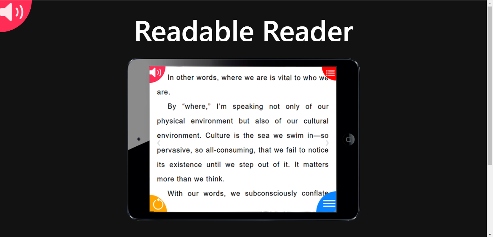
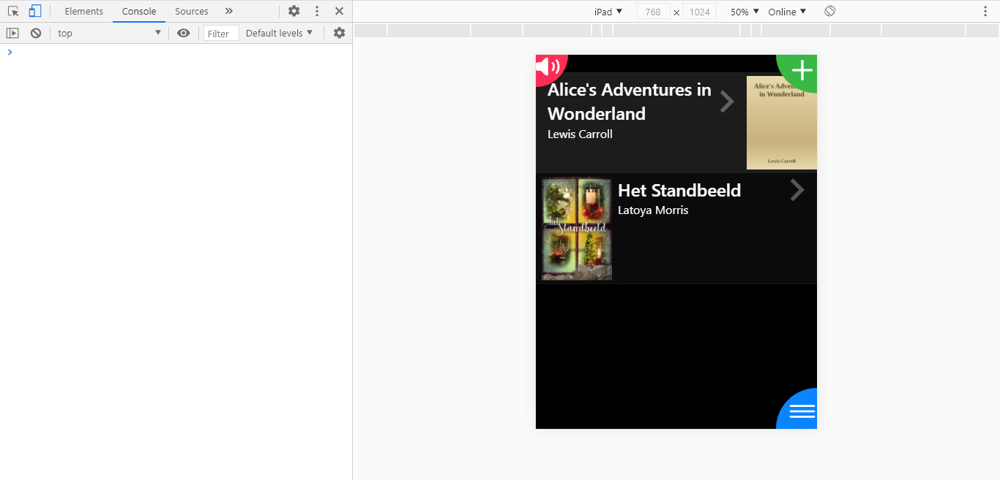

# [Serval](https://nl.wikipedia.org/wiki/Serval_(katachtige))

## Opdracht

Bekijk hier de officiële opdracht: 
[Readable Reader](opdracht)

De readable Reader is een webapp die speciaal bedoelt is voor slechtziende/dyslecten.
Voor deze doelgroep is er geen goed app omdat je nooit genoeg dingen kunt aanpassen.
Zoals de kleur van het font of de font groote of de achtergrond etc.

Wij hebben een webapp gemaakt waarbij een boek geimporteerd kan worden en deze gelezen kan worden.
Daarbij kan de font-groote, font, font-spacing, line-height aangepast worden en zijn er thema's die gekozen kunnen worden voor lettertype kleur en achtergrondkleur.

## Installation guide

Voordat je de frontend en de backend start, run eerst de onderstaande command in de directories `readablereader/readablereaderAPI` en `readablereader/readablereaderAPP`:

```http
npm install
```

### Frontend
De frontend react app staat in `readablereader/readablereaderAPP`. Om de react app op te starten type je onderstaand command in de terminal.
Run de app in chrome. 

```http
npm start
```

### Backend
De backend Node.js server staat in `readablereader/readablereaderAPI`. Om de server te starten kun je één van de onderstaande commands gebruiken.
Er is geen seed file waar gebruik van gemaakt wordt, wel moet mongo aan staan en de database heet readableReader.

```http
nodemon

nodemon index.js

node index.js
```

Als de frontend en backend allebei opgestart zijn, moet het er ongeveer zo uit zien:



Zet de applicatie in de chrome devtools: doe een rechtermuis klik op de webpagina en klik inspect aan.
Op dat moment kun je op toggle device toolbar klikken (telefoon pictogram in de hoek) en de weergave 'responsive' omzetten in ipad (bovenin het scherm). Doe daarna een harde refresh, zodat de app naar het juiste formaat gaat.
De gehele app zou je in ipad weergave moeten gebruiken, het moet er ongeveer zo uitzien:


### E2E tests

De E2E tests staan in de `readablereader/readablereaderAPI` directory. 
Om de end to end tests te runnen gebruik je onderstaand command.

```http
npm run e2e
```

### Unit en integratie tests

De unit tests gaan over de componenten en staan in het mapje `readablereader/readablereaderAPP`.
De integratie tests gaan over de database en staan in het mapje `readablereader/readablereaderAPI`.
Run in beide directories de onderstaande command:

```http
npm test
```

## Usage

Om een korte beschrijving te hebben van elke pagina kan er op de roze luidspreker button geklikt worden op elke pagina. 
Deze button activeert de tekst to speech die een korte introductie geeft hoe de pagina werkt. 

### Inloggen

Als nieuwe gebruiker moet er eerst een nieuw account aangemaakt worden, klik op account aanmaken. 

Vul een gebruikersnaam in en klik daarna op account aanmaken, hieronder is een voorbeeld.


Vul daarna een pincode in die bij de gebruikersnaam hoort, hieronder is een voorbeeld.


### Boek uploaden

Om een boek te uploaden moet een epub file beschikbaar zijn. Er staan in `readablereader/readablereaderAPI/test/` twee engelse en één nederlands boek. 

Om een boek te uploaden klik je op de groene knop rechts bovenin. Deze opent een filechooser waarbij je de epub file kunt selecteren. 


Óf er kan gekozen worden om naar de upload pagina te gaan via het menu:
Klik op de menu button rechts onderin, klik op "Upload Boek". Dan zou de pagina te zien zijn zoals hier onder.
Klik vervolgens op de button "Bestand kiezen", dit opent een filechooser waarbij de epubfile geselecteerd kan worden.
Hierna moet er op de "Upload" button geklikt worden. 


Als een boek geupload is dan zou het er zo uit moeten zien:



Om een boek te verwijderen swipe je van rechts naar links over het boek heen:


Om de titel en de auteur voor gelezen te hebben, swipe je van links naar rechts over het boek heen:


### Boek lezen

Klik in de boekenkast op het boek dat je wilt lezen.
Elke keer als je het boek opent, brengt hij je naar waar je gebleven was. 
Het zou er zo moeten uitzien als je een boek voor de eerste keer opent:


#### Text to speech

De text to speech wordt geactiveerd door een woord te selecteren (lang inhouden). Na de selectie komen er twee knoppen bovenaan in beeld. 
Klik op de play knop om de text to speech te starten en op de stop knop om het te laten stoppen.


Om de text to speech snelheid aan te passen, ga naar de menu knop rechts onderin en klik op instellingen.
Op dat moment zie je dit:


Daar kun je op "Tekst to speech snelheid" klikken en de snelheid aanpassen. 0.5 is langzaam en 2.0 is erg snel.
Ook kun je bij instellingen de boekenweergave veranderen van scollen naar bladeren of andersom. 

#### Preferences aanpassen

Klik op de rode knop rechts bovenin om de tekst grootte, tekst kleur, achtergrondkleur, lettertype, letterafstand of regelafstand aan te passen.
Het zou er ongeveer zo uit moeten zien:


Swipe op het grijze vlak om de andere opties aan te kunnen passen. Klik op OK om de instellingen te behouden en de CANCEL knop om de instellingen te verwijderen. 


#### Terug naar een andere pagina

Klik op de blauwe knop rechts onderin. Nu komt er een menu met verschillende pagina's waar je heen kan. 

- Boek lezen: ga naar het boek dat je aan het lezen was
- Boekenkast: krijg een overzicht van welke boeken je hebt en welke je meest recent gelezen hebt (hoe verder bovenaan, hoe recenter gelezen of geupload)
- Upload boek: upload een nieuw boek
- Instellingen: verander de manier van lezen (bladeren of scrollen) en verander de snelheid van de text to speech
- Account: verander het wachtwoord of log uit


